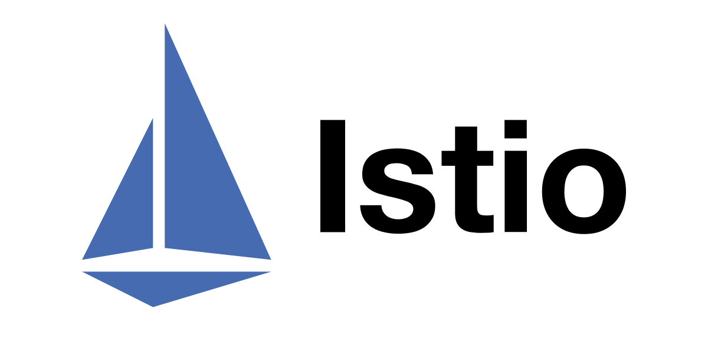

# Steadybit extension-istio

This [Steadybit](https://www.steadybit.com/) extension enables the injection of HTTP and gRPC faults into [Istio's virtual services](https://istio.io/latest/docs/reference/config/networking/virtual-service).

Learn about the capabilities of this extension in our [Reliability Hub](https://hub.steadybit.com/extension/com.github.steadybit.extension_istio).

## Configuration

| Environment Variable               | Helm value               | Meaning                  | Required | Default |
|------------------------------------|--------------------------|--------------------------|----------|---------|
| `STEADYBIT_EXTENSION_CLUSTER_NAME` | `kubernetes.clusterName` | Kubernetes cluster name. | yes      |         |

The extension supports all environment variables provided by [steadybit/extension-kit](https://github.com/steadybit/extension-kit#environment-variables).

## Installation

### Using Helm in Kubernetes

```sh
helm repo add steadybit-extension-istio https://steadybit.github.io/extension-istio
helm repo update
helm upgrade steadybit-extension-istio \
    --install \
    --wait \
    --timeout 5m0s \
    --create-namespace \
    --namespace steadybit-extension \
    --set kubernetes.clusterName="my-cluster" \
    steadybit-extension-istio/steadybit-extension-istio
```

## Register the extension

Make sure to register the extension at the steadybit platform. Please refer to
the [documentation](https://docs.steadybit.com/integrate-with-steadybit/extensions/extension-installation) for more information.
